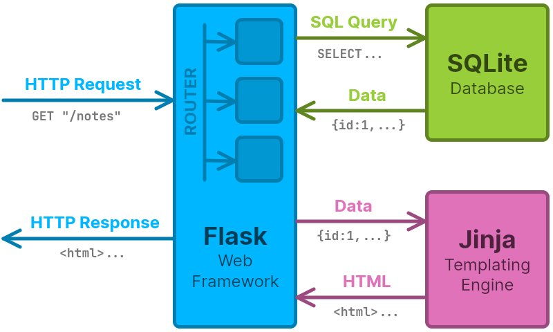

# How Does a Flask Web App Work?

A **web application** is a program that runs on a web server and **delivers interactive content through a web browser**. Unlike static websites that just display fixed information, web apps respond to user actions (clicking buttons, filling in forms, etc.) and generate personalised, dynamic responses.

Examples of web apps that you might use: social media (posting, liking, commenting), online shopping (adding to cart, checking out), messaging (sending, reading, replying), etc.

Flask lets you build these interactive web applications as part of a web development 'tech stack'...

## The Web Development Tech 'Stack'

A 'tech stack' is the collection of technologies that work together to build a web app. This project uses five main components:

| Framework / Library                           | Description                                                                                                                                                                                                            |
| --------------------------------------------- | ---------------------------------------------------------------------------------------------------------------------------------------------------------------------------------------------------------------------- |
|    | [Python](https://www.python.org/) is a versatile programming language that's easy to read and write. It powers the backend logic of your web app, handling data, making decisions, etc.                                |
|      | [Flask](https://flask.palletsprojects.com/) is a lightweight Python web framework that handles URL routing and HTTP requests/responses. It's minimal and flexible, letting you build web apps without heavy structure. |
|     | [Jinja](https://jinja.palletsprojects.com/templates/) is a templating engine that lets you embed Python-like logic into HTML. Use data variables, loops, and conditionals to generate dynamic web pages.               |
|    | [SQLite](https://sqlite.org/) is a lightweight, file-based database that stores structured data. No database server is needed - it runs directly in your app and uses standard SQL queries.                              |

### How a Flask Web App Works

When someone interacts with your Flask application (e.g. clicks a link, fills in a form, etc.), here is what happens:

1. **Browser sends request** → HTTP request, e.g. `GET "/notes"`
2. **Flask routes the request** → Flask matches URL to a Python function, e.g. `show_notes()`
3. **Python processes the request** → Your code runs, querying the database if needed
4. **SQLite Database is queried** if needed → SQL query, e.g. `SELECT * FROM note`
5. **Database returns data** → SQLite sends back the requested data
6. **Jinja generates HTML** → Template combines the data with HTML structure
7. **Server sends response** → Flask sends the complete webpage to the browser
8. **Browser displays page** → User sees the styled, interactive result

**In simple terms:** Flask is the 'conductor', SQLite stores your data, Jinja builds your pages, and your CSS makes them look good - all working together to create interactive web experiences.

